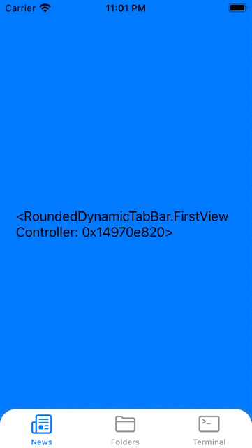

# Dynamic Rounded TabBar - iOS

Example of the JSON file: 

```
[
    {
        "navigation": "vc1",
        "image": "newspaper",
        "selectedImage": "",
        "order": 0,
        "title": "News"
    },
    {
        "navigation": "vc2",
        "image": "folder",
        "selectedImage": "folder.fill",
        "order": 1,
        "title": "Folders"
    },
    {
        "navigation": "vc3",
        "image": "terminal",
        "selectedImage": "terminal.fill",
        "order": 2,
        "title": "Terminal"
    }
]
```

And the output is:


